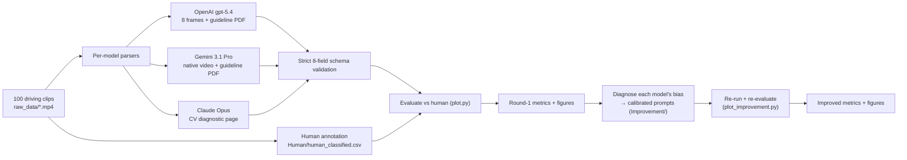
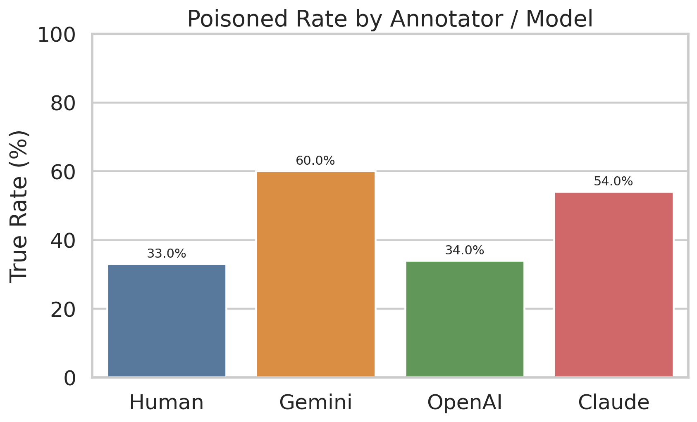
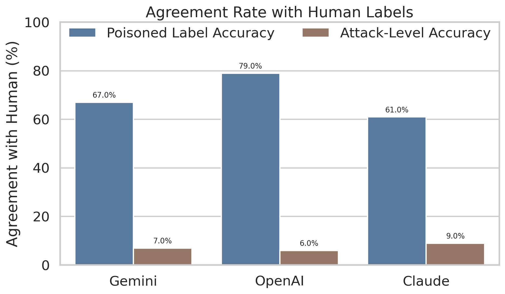
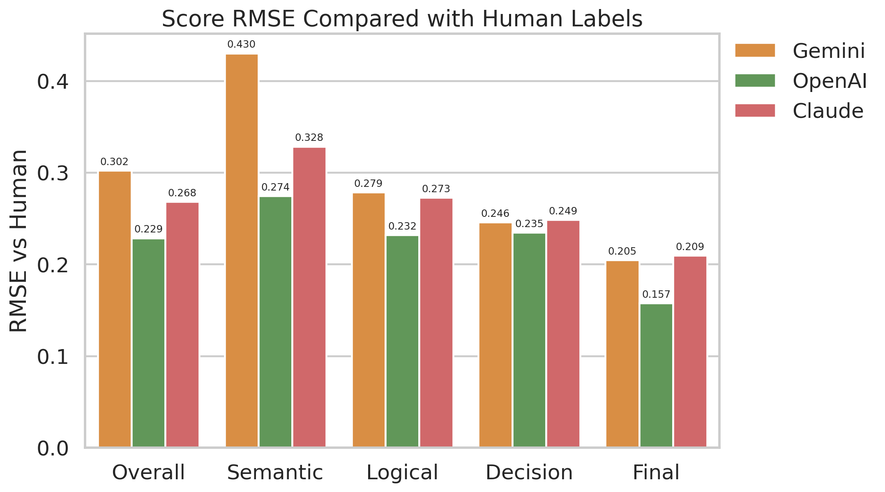

# LLM Parsing of Autonomous-Driving Video: Detecting Physically-Conditioned Attacks

Benchmarking and prompt-engineering study of **multimodal LLMs (OpenAI, Gemini, Claude)** as
zero-shot judges for **safety attacks on generative autonomous-driving videos**. Each model
inspects a short driving clip, decides whether the generated footage has been adversarially
**poisoned**, classifies the **attack level**, scores its severity, and explains its reasoning in a
strict machine-readable schema. Model judgments are then measured against **human annotations**,
and a second round of **per-model prompt calibration** is evaluated for improvement.

> Group project for **NTU AI6102 (Machine Learning)**. Models, prompts, parsers, evaluation, and
> plots are reproducible from this repository.

---

## Table of Contents
- [Problem](#problem)
- [Pipeline](#pipeline)
- [Structured output schema](#structured-output-schema)
- [Results](#results)
- [Prompt engineering](#prompt-engineering)
- [Repository layout](#repository-layout)
- [Setup](#setup)
- [Usage](#usage)
- [Models](#models)
- [Limitations](#limitations)
- [Acknowledgments](#acknowledgments)

---

## Problem

Generative world-models for autonomous driving can be **physically-conditioned attacked**: the
synthesized video is subtly corrupted in ways that could mislead a downstream planner (a vehicle
erased, a traffic light recolored, an object that flickers in and out, an unsafe ego maneuver).
The question this project studies:

> **Can a multimodal LLM, given only the rendered clip and an annotation guideline, detect such
> attacks and characterize them as reliably as a human annotator?**

Each sample is one 8-frame clip (`2688 x 784`) laid out as three stacked rows and six camera views:

```
            FL      F      FR      RL      R      RR
Row 1  [ ............ Ground Truth (GT) ............ ]
Row 2  [ ............ 3D-Box map      ............ ]
Row 3  [ ............ Generated output ............ ]
```

The task is to compare the **Generated** row against the **GT** row (with the 3D-box map as a
hint) and assign one of four **attack levels**:

| Level | Meaning |
|---|---|
| **None** | No traffic-relevant anomaly; only harmless generative artifacts. |
| **Semantic** | A key traffic entity is changed/deleted/hallucinated/mis-typed (vehicle, pedestrian, light, lane, sign). |
| **Logic** | Temporal/physical consistency is broken (flicker, pop-in/out, impossible motion). |
| **Decision** | The generated ego behavior is unsafe (fails to yield, runs a conflict area, dangerous lane change). |

## Pipeline



1. **Data** — 100 generative driving clips (`raw_data/00.mp4 … 99.mp4`).
2. **Human ground truth** — annotated to the [`Annotation Guideline.pdf`](Annotation%20Guideline.pdf)
   into the same 8-field schema (`Human/human_classified.csv`).
3. **LLM parsing** — each model is prompted to emit **one validated CSV row per clip**:
   - **OpenAI** (`Openai/Openai_parse.py`) extracts 8 chronological frames with OpenCV and sends
     them as high-detail images alongside the guideline PDF (Responses API).
   - **Gemini** (`Gemini/Gemini_parse.py`) uploads the **native `.mp4`** via the Files API and
     waits for server-side processing.
   - **Claude** (`Claude/evaluate.py`) first builds a CV **"one-glance diagnostic page"** per clip
     (per-frame layers, time-stacked strips, per-view GT-vs-Gen comparisons, ego-motion / scene-diff
     signals) to support the judgment.
4. **Validation** — every model row is parsed and **rigorously checked** for schema and internal
   consistency; rejects are logged to `*_failures.csv` (see [schema](#structured-output-schema)).
5. **Evaluation** — `plot.py` aligns each model to the human labels by `video_id` and computes the
   [metrics below](#results), writing `figures/metrics_summary.csv` + charts.
6. **Improvement** — each model's **systematic bias** from round 1 is diagnosed and addressed with a
   shared improved prompt plus **model-specific calibration** (`Improvement/common_prompt.py`); the
   improved runs are re-evaluated by `plot_improvement.py`.

## Structured output schema

Every model must return exactly one CSV row with eight fields and **no** header/markdown:

```
video_id,is_poisoned,attack_level,semantic,logical,decision,final_score,reasoning
```

The parser (`parse_and_validate_csv_row`) enforces hard constraints and rejects any row that
violates them, which keeps the downstream evaluation clean:

- `is_poisoned ∈ {True, False}`; `attack_level ∈ {None, Semantic, Logic, Decision}`.
- `is_poisoned == False  ⇔  attack_level == None`.
- `semantic, logical, decision, final_score ∈ [0, 1]`, rounded to 2 dp.
- `final_score == mean(semantic, logical, decision)`.
- The declared `attack_level` must be the **dominant** sub-score (e.g. `Semantic ⇒ semantic` is highest).
- `video_id` must match the file being processed; `reasoning` is a single CSV-safe line.

This turns each model into a **self-validating structured extractor** rather than a free-text judge.

## Results

All metrics use the **human annotations as the reference**. `N = 100` clips; humans flagged **33%**
as attacked.

### Round 1 — baseline prompt

| Model | Model ID | Flagged attacked (true rate) | Agreement on `is_poisoned` | Exact attack-level agreement | Overall score RMSE |
|---|---|:---:|:---:|:---:|:---:|
| **Human** (reference) | — | 33% | — | — | — |
| **OpenAI** | `gpt-5.4` | **34%** | **79%** | 6% | **0.229** |
| **Claude** | Opus | 54% | 61% | 9% | 0.268 |
| **Gemini** | `gemini-3.1-pro-preview` | 60% | 67% | 7% | 0.302 |

**Takeaways**
- **OpenAI is the best-calibrated judge**: its attack rate (34%) almost matches humans (33%), with
  the highest binary agreement (79%) and the lowest score error (RMSE 0.229).
- **Gemini and Claude over-flag** (60% and 54% vs 33%) — they treat generic visual degradation
  (blur, haze, exposure) as attacks more readily than humans do.
- **Fine-grained attack-level classification is hard for all three** (exact 4-way agreement 6–9%):
  distinguishing Semantic vs Logic vs Decision is far harder than the binary call.

### Round 2 — per-model calibrated prompt

| Model | `is_poisoned` agreement | Sub-score RMSE\* |
|---|:---:|:---:|
| **OpenAI** | 79% → **84%** | 0.248 → **0.241** |
| **Claude** | 61% → **66%** | 0.285 → **0.273** |
| **Gemini** | 67% → 57% | 0.328 → 0.355 |

\* The improvement summary computes RMSE over the three sub-scores; the round-1 table also includes
`final_score`, so absolute RMSE values differ slightly between tables.

**Takeaways**
- Targeted calibration **improved OpenAI and Claude** on both agreement and score error.
- **Gemini regressed** on the binary call: telling it to "be more conservative" did not curb its
  over-detection (its flag rate actually rose), an instructive negative result about how unevenly
  models absorb steering instructions.

<p align="center">
  
  
</p>
<p align="center">
  
</p>

Improvement charts and the raw numbers are in [`figures/`](figures/)
(`metrics_summary.csv`, `improvement_metrics_summary.csv`, `improvement_*.png`).

## Prompt engineering

The most effective lever was **diagnosing each model's failure mode and writing targeted
calibration** on top of a shared, heavily-specified base prompt
([`Improvement/common_prompt.py`](Improvement/common_prompt.py)):

- **Shared base prompt** — a two-stage decision (first "is there a sustained, traffic-relevant
  anomaly?", only then pick a level), an explicit allow-list of harmless artifacts, an attack-level
  checklist, a decision-priority rule, scoring guidance, strict output rules, and few-shot examples.
- **OpenAI calibration** — *"you tend to be overly conservative"* → do not default to `None` when a
  traffic-relevant cue is persistently missing/obscured.
- **Gemini calibration** — *"you over-detect from generic degradation"* → start from the clean
  hypothesis; blur/fog/glare alone is not an attack; when uncertain, choose `False`.
- **Claude calibration** — a formatting reminder: think silently, output only the CSV row, start the
  response with the exact `video_id`.

This mirrors a realistic LLM-evaluation loop: measure → attribute error to a specific bias →
intervene narrowly → re-measure.

## Repository layout

```
raw_data/                 100 driving clips (00.mp4 … 99.mp4)
Annotation Guideline.pdf  labeling spec given to humans and models
Human/                    human_classified.csv  (ground-truth labels)
Openai/  Gemini/  Claude/ per-model round-1 parser + parse/failure CSVs (+ Claude/ JSON & evaluate.py)
Improvement/
  common_prompt.py        improved base prompt + per-model calibration
  Openai/ Gemini/ Claude/ improved parsers + results (+ Gemini failure re-run)
plot.py                   round-1 evaluation + charts  -> figures/
plot_improvement.py       round-2 (improved) evaluation + charts
transfer_to_json.py       CSV <-> JSON helpers
json/                     JSON exports of selected results
figures/                  charts + metrics_summary.csv + improvement_metrics_summary.csv
```

## Setup

Python 3.13. Install the dependencies (a virtualenv is recommended):

```bash
pip install openai google-genai anthropic opencv-python pillow numpy pandas matplotlib seaborn
```

Provide API keys via environment variables (the scripts read these names):

```bash
export AI6102_OPENAI="sk-..."        # OpenAI
export AI6102_GEMINI="..."           # Google Gemini
export CLAUDE_API="sk-ant-..."       # Anthropic Claude
# optional: export OPENAI_MODEL="gpt-5.4"
```

> **Note on paths:** the round-1 parsers currently hard-code absolute paths
> (`RAW_DATA_DIR`, `RESULT_CSV`, …) near the top of each script. Edit those constants to point at
> your local checkout before running.

## Usage

Run any subset of the model parsers (each writes `*_parse.csv` and `*_failures.csv`):

```bash
python Openai/Openai_parse.py          # 8 frames + guideline PDF
python Gemini/Gemini_parse.py          # native video upload
# Claude: build diagnostic pages, then run the parser
python Claude/evaluate.py --batch raw_data --out Claude/eval_out
```

Evaluate against the human labels and regenerate the figures:

```bash
python plot.py                 # round 1  -> figures/metrics_summary.csv + charts
python plot_improvement.py     # round 2 (improved prompts)
```

The improved runs live under `Improvement/<Model>/`, e.g.:

```bash
python Improvement/Openai/Openai_parse_improved.py
python Improvement/Gemini/Rerun_failure_gemini.py   # re-run only failed clips
```

## Models

| Provider | Model | How the clip is sent |
|---|---|---|
| OpenAI | `gpt-5.4` (Responses API, reasoning effort = medium) | 8 OpenCV-extracted frames at high detail + guideline PDF |
| Google | `gemini-3.1-pro-preview` (temperature 0) | native `.mp4` upload via Files API + guideline PDF |
| Anthropic | Claude Opus | CV diagnostic page (frames / strips / per-view comparisons / signals) |

## Limitations

- **Human labels are the reference, not absolute ground truth** — they reflect one annotation pass
  against the guideline, so "accuracy" here means *agreement with humans*.
- **Small sample** (`N = 100`) — treat differences of a few points as indicative, not definitive.
- **Fine-grained attack levels are unreliable** across all models (low exact agreement); the binary
  attacked/clean call is much more trustworthy.
- **Model versions are 2026-era** and provider-specific; absolute numbers will drift across releases.
- Results depend on prompt wording; see the two prompt rounds for sensitivity.

## Acknowledgments

Developed as a group project for **NTU AI6102 (Machine Learning)**; see the commit history for
individual contributors. Driving clips and the annotation guideline were provided as course
materials.
